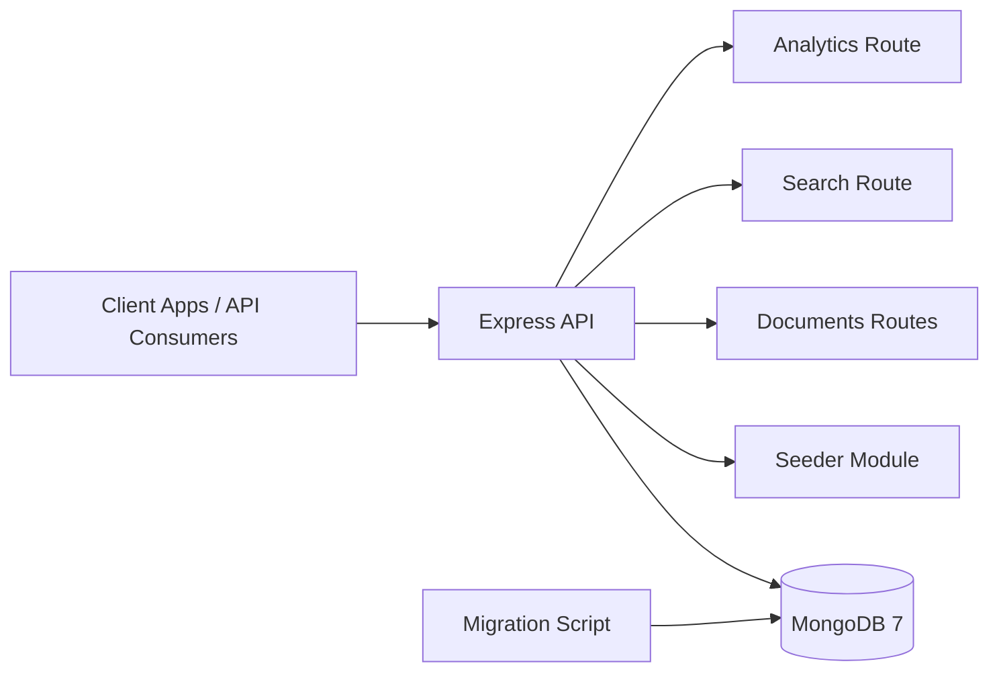
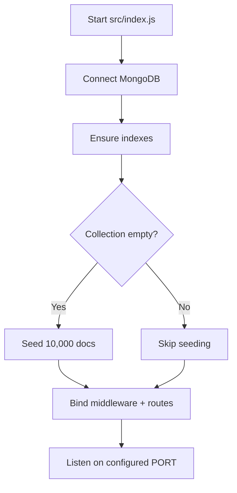
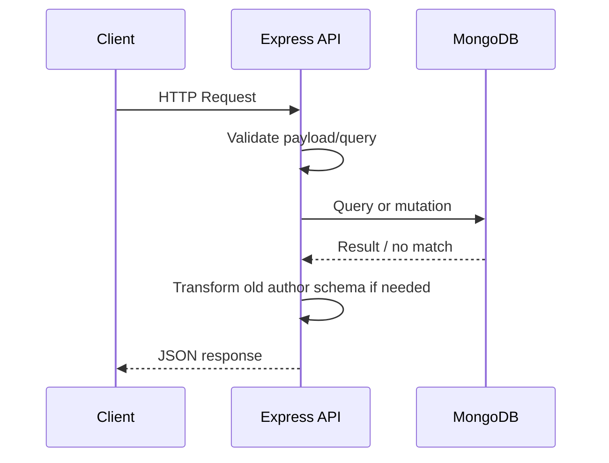
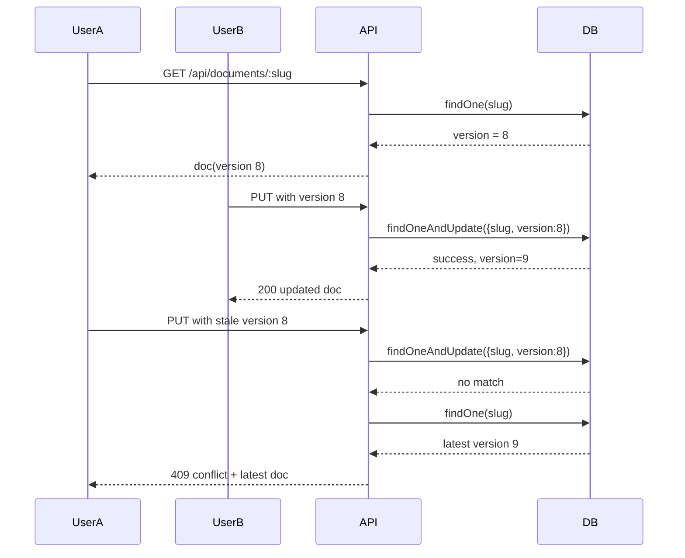
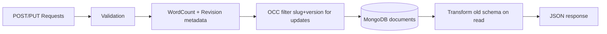

# DocuForge - Collaborative Document Store


A production-grade backend for collaborative wiki-style document authoring with optimistic concurrency control, full-text search, analytics aggregations, and schema migration support.

## GitHub Pages

This repository includes a static documentation site built from the markdown files in the repo and deployed through GitHub Pages. The site is generated from `README.md`, `architecture.md`, and `projectdocumentation.md`, so the published docs stay aligned with the source documentation.

The deployment workflow lives in `.github/workflows/pages.yml`, and the generated site can be built locally with `npm run build:pages`.
Enable GitHub Pages in repository settings and choose GitHub Actions as the source so the workflow can publish the site.

## Render Deployment

The backend API can be deployed on Render as a Docker web service. The deployment blueprint is defined in `render.yaml`, and the app exposes a `/health` endpoint that Render can use for health checks.

Before deploying, create a MongoDB Atlas cluster or another externally reachable MongoDB instance and set `MONGO_URI` in Render to that connection string. The `DATABASE_NAME` default is `wikidocs`.

Deployment flow:

1. Push this repository to GitHub.
2. Create a new Render Web Service from the repo or apply the `render.yaml` blueprint.
3. Set `MONGO_URI` to your MongoDB connection string.
4. Leave `DATABASE_NAME` as `wikidocs` unless you want a different database name.
5. Deploy and verify `https://<your-service>.onrender.com/health` returns `{"status":"ok"}`.

## 1. Project Overview

DocuForge provides a robust backend API to create, update, search, analyze, and migrate document data at scale. It is designed for environments where multiple users may edit content concurrently and where indexing, analytics, and schema evolution must coexist without downtime.

Core capabilities:
- Document CRUD with server-generated slug management
- Optimistic concurrency control (version-safe updates)
- Full-text search with weighted relevance scoring
- Tag-filtered search with AND semantics
- Analytics endpoints using MongoDB aggregation pipelines
- Lazy schema compatibility and background migration tooling
- Auto-seeding of 10,000 documents for realistic load simulation

## 2. Tech Stack

| Layer | Technology | Purpose |
|---|---|---|
| Runtime | Node.js 20+ | High-performance JavaScript server runtime |
| Framework | Express 4 | REST API routing and middleware pipeline |
| Database | MongoDB 7 | Document persistence, text indexing, aggregation |
| Driver | mongodb v6 | Native driver for efficient DB access |
| Utilities | slugify, diff | Slug generation and revision diff metadata |
| Containerization | Docker + Docker Compose | Reproducible local/dev deployment |

## 3. System Landscape



## 4. Workflow and Execution Flow

### 4.1 Application Bootstrap Flow



### 4.2 Request Lifecycle



### 4.3 Optimistic Concurrency (Update Path)



## 5. Code Structure and Folder Organization

```text
.
|- docker-compose.yml
|- Dockerfile
|- package.json
|- README.md
|- architecture.md
|- projectdocumentation.md
|- scripts/
|  |- migrate_author_schema.js
|- src/
   |- db.js
   |- index.js
   |- seed.js
   |- middleware/
   |  |- errorHandler.js
   |- routes/
      |- analytics.js
      |- documents.js
      |- search.js
```

## 6. Setup and Installation

### 6.1 Prerequisites
- Node.js 20+
- npm 10+
- Docker Desktop (for containerized run)
- MongoDB instance (only needed for non-Docker local run)

### 6.2 Environment Configuration

1. Copy environment template:

```bash
cp .env.example .env
```

2. Default variables:

| Variable | Default | Notes |
|---|---|---|
| MONGO_URI | mongodb://mongo:27017 | Use localhost URI for local non-Docker run |
| DATABASE_NAME | wikidocs | Logical database name |
| PORT | 3000 | API bind port |

## 7. Run Locally

### 7.1 Docker Compose (Recommended)

```bash
docker-compose up --build
```

Available endpoints:
- http://localhost:3000/health
- http://localhost:3000/api/documents
- http://localhost:3000/api/search
- http://localhost:3000/api/analytics/most-edited
- http://localhost:3000/api/analytics/tag-cooccurrence

### 7.2 Native Node.js Run

```bash
npm install
MONGO_URI=mongodb://localhost:27017 npm start
```

Development mode with auto-reload:

```bash
MONGO_URI=mongodb://localhost:27017 npm run dev
```

## 8. Usage Instructions

### 8.1 Health Check

```bash
curl http://localhost:3000/health
```

### 8.2 Create Document

```bash
curl -X POST http://localhost:3000/api/documents \
  -H "Content-Type: application/json" \
  -d '{
    "title": "MongoDB Guide",
    "content": "This is a collaborative wiki page.",
    "tags": ["mongodb", "guide"],
    "authorName": "Jane Doe",
    "authorEmail": "jane@example.com"
  }'
```

### 8.3 Fetch Document

```bash
curl http://localhost:3000/api/documents/mongodb-guide
```

### 8.4 Safe Update with OCC

```bash
curl -X PUT http://localhost:3000/api/documents/mongodb-guide \
  -H "Content-Type: application/json" \
  -d '{
    "title": "MongoDB Guide v2",
    "content": "Updated content.",
    "version": 1
  }'
```

### 8.5 Search by Text and Tags

```bash
curl "http://localhost:3000/api/search?q=mongodb&tags=guide,backend"
```

### 8.6 Analytics

```bash
curl http://localhost:3000/api/analytics/most-edited
curl http://localhost:3000/api/analytics/tag-cooccurrence
```

### 8.7 Run Migration Script

```bash
npm run migrate
```

## 9. Data Flow View



## 10. Verification and Validation Steps

1. Bring up database and API.
2. Verify /health returns status ok.
3. Create a document and capture slug.
4. Perform update with correct version and expect HTTP 200 with incremented version.
5. Repeat update using stale version and expect HTTP 409 with latest document body.
6. Run text search and validate results include score and descending relevance.
7. Run both analytics endpoints and validate non-empty arrays.
8. Execute migration and verify remaining old-schema count reaches 0.

## 11. Production Readiness Notes

Implemented:
- Atomic OCC update path to prevent lost updates
- Deterministic indexes for read/query performance
- Robust startup order through Docker healthchecks and depends_on
- Global error middleware for consistent API failures
- Seed tooling and migration tooling for lifecycle support

Recommended next hardening:
- Add authentication/authorization (JWT/OIDC)
- Add rate limiting, request logging, and tracing
- Add CI pipeline with automated integration tests
- Add graceful shutdown and readiness probes for orchestrators

## 12. Documentation Suite

This project ships with:
- README.md: operational guide and visual overview
- architecture.md: architecture and design deep dive
- projectdocumentation.md: complete technical documentation and verification playbook
