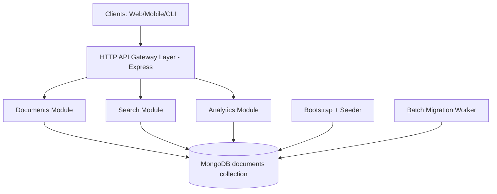
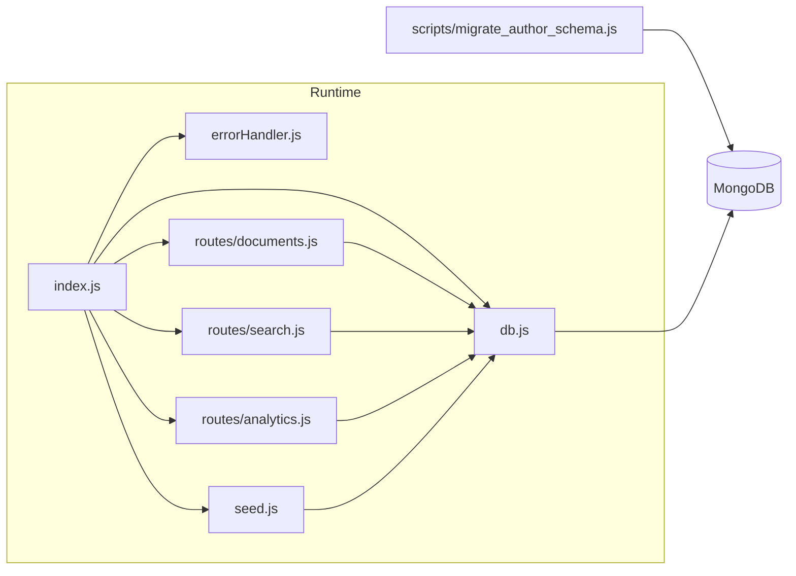
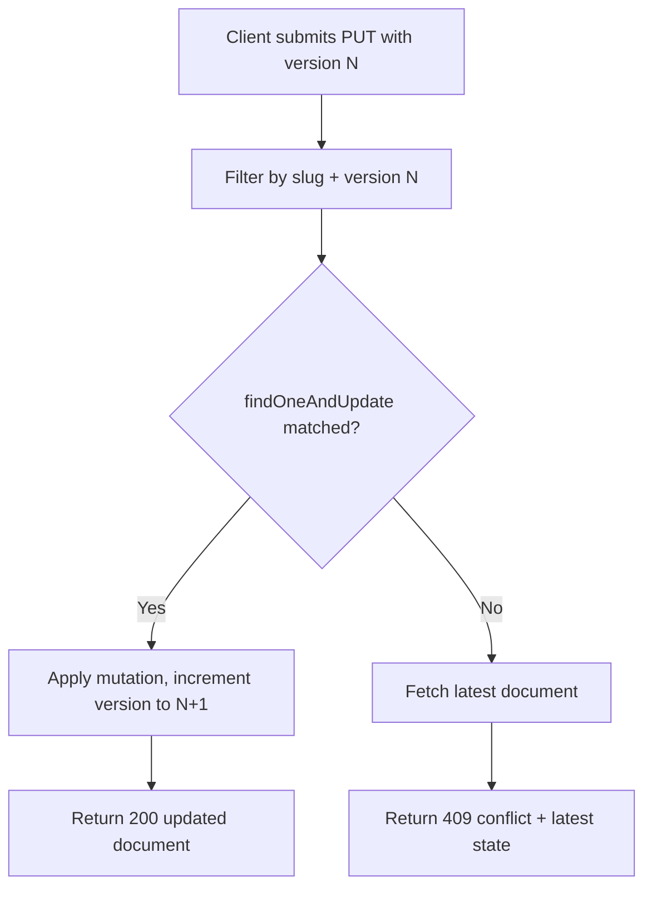
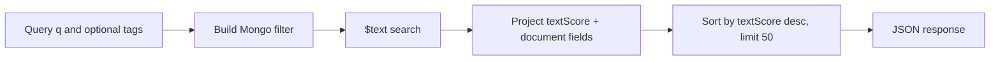
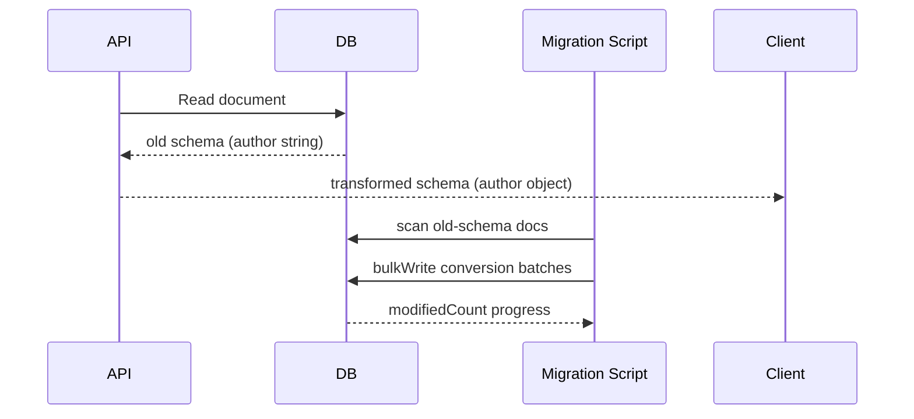

# Architecture Documentation - DocuForge

## 1. Architecture Objective

DocuForge is built as a modular backend architecture that supports collaborative document editing, text retrieval, operational analytics, and schema evolution while maintaining data consistency under concurrent updates.

Design priorities:
- Consistency under concurrent edits
- Query performance at scale
- Operability in local and containerized environments
- Backward compatibility during schema transitions
- Clear separation of concerns by route/module boundaries

## 2. High-Level Architecture

## 3. Component Topology

## 4. Module Responsibilities

| Module | Responsibility | Key Behaviors |
|---|---|---|
| index.js | App bootstrap and runtime wiring | Connects DB, runs seed, mounts routes, starts server |
| db.js | Database lifecycle abstraction | Singleton client setup, retrieval, and close |
| seed.js | Initial data/index provisioning | Ensures indexes, inserts 10k documents in batches |
| routes/documents.js | CRUD and OCC logic | Version-aware atomic update, schema transform on read |
| routes/search.js | Full-text retrieval | Mongo text search, relevance sort, optional tag filtering |
| routes/analytics.js | Derived insights | Most edited and tag co-occurrence pipelines |
| errorHandler.js | Unified failure responses | Converts thrown errors to stable JSON format |
| migrate_author_schema.js | Background schema migration | Batch bulkWrite conversion string author -> object |

## 5. Data Model Architecture

### 5.1 Core Document Schema
- slug: canonical API lookup key
- title, content: primary user content with text index coverage
- version: optimistic concurrency counter
- tags: classification and filtering metadata
- metadata.author: object schema target for normalized author info
- revision_history: rolling revision audit trail

### 5.2 Index Strategy
- Unique index on slug:
  - Guarantees deterministic URL/resource identity
  - Prevents duplicate logical documents
- Weighted text index on title + content:
  - Higher weight for title to improve ranking quality
  - Supports textScore-based relevance ordering

## 6. Concurrency Control Architecture

Why this works:
- The predicate and mutation execute atomically in one database operation.
- Stale writers cannot overwrite newer state.
- Clients can reconcile using returned latest payload.

## 7. Search and Analytics Architecture

### 7.1 Search Pipeline

### 7.2 Analytics Pipelines
- most-edited:
  - Projects editCount via size(revision_history)
  - Sorts descending and limits top 10
- tag-cooccurrence:
  - Filters docs with 2+ tags
  - Generates unique tag pairs per document
  - Aggregates global pair frequencies
  - Returns ranked pairs

## 8. Schema Evolution Strategy

Two-phase migration model:
1. Lazy compatibility layer in read path:
   - If metadata.author is string, transform to object in memory
   - No immediate write required
2. Background durable migration script:
   - Reads old-schema documents in batches
   - Applies bulkWrite updates for throughput
   - Idempotent and resumable behavior

## 9. Deployment Architecture

### 9.1 Docker Compose Roles
- mongo service:
  - Persistent volume for data durability
  - Healthcheck with ping command
- api service:
  - Depends on healthy mongo
  - Receives environment via compose
  - Mounts source/script volumes for iterative development

### 9.2 Startup Contract
- API starts only after Mongo health passes.
- App boot then ensures indexes and data availability.

## 10. Scalability and Performance Considerations

Strengths:
- Index-backed retrieval paths for lookup/search
- Batch writes during seed and migration to reduce overhead
- Route-level specialization keeps logic maintainable
- OCC avoids expensive lock management while preserving correctness

Constraints and trade-offs:
- Single collection design is simple but can grow large without archival strategy
- Full-text search is Mongo-native; semantic ranking would need separate vector/search subsystem
- API currently stateless but no cache layer yet for hot reads

Scale-out options:
- Horizontal API scaling behind load balancer
- Mongo replica set for HA and read scaling
- Add Redis cache for popular document/search queries
- Move analytics heavy jobs to async worker pipeline

## 11. Reliability, Security, and Operational Gaps

Implemented:
- Health endpoint
- Consistent error response format
- Startup failure exits fast for visibility
- Migration script progress logs and final verification

Recommended for production hardening:
- AuthN/AuthZ middleware
- Input schema validation library (Joi/Zod)
- Rate limiting and abuse controls
- Structured logging and distributed tracing
- Backup and restore runbooks

## 12. Why This Stack Was Chosen

- Node.js + Express: fast development, mature ecosystem, efficient JSON APIs
- MongoDB: natural fit for evolving document schemas and text indexing
- Native Mongo driver: direct control over atomic operations and pipelines
- Docker Compose: low-friction local reproducibility and onboarding

This architecture balances implementation speed, operational clarity, and room for future scaling while already supporting non-trivial concurrency and migration requirements.
