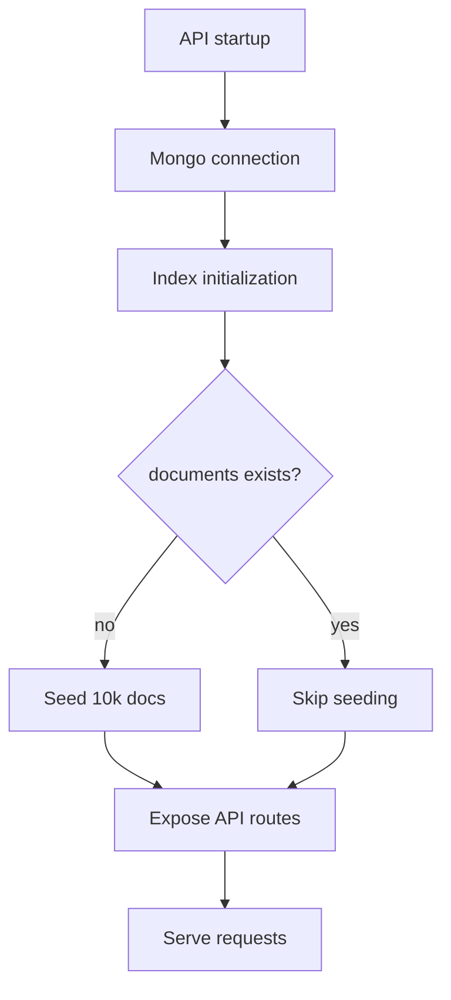
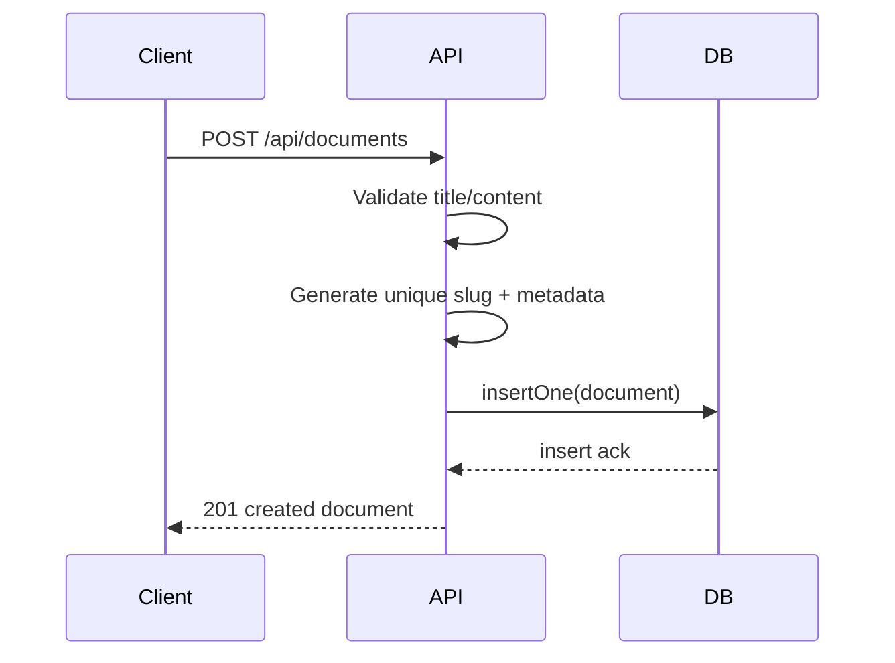
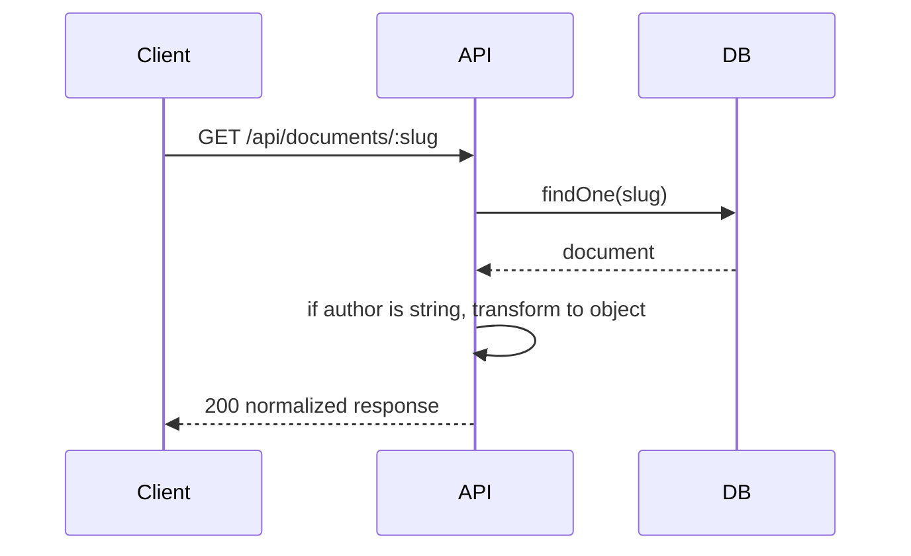
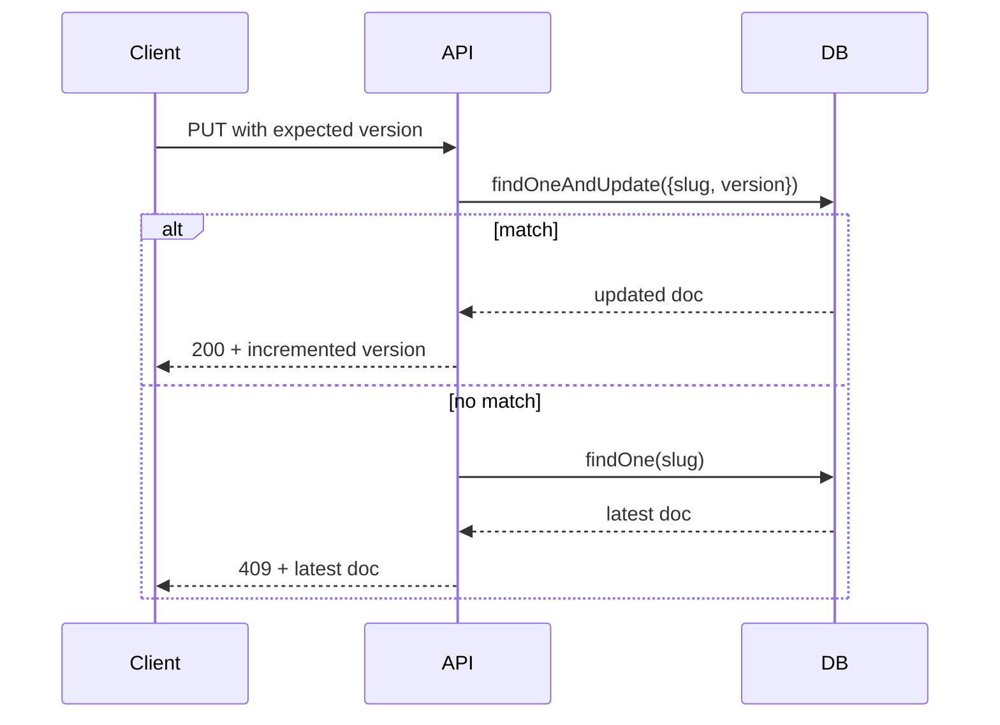
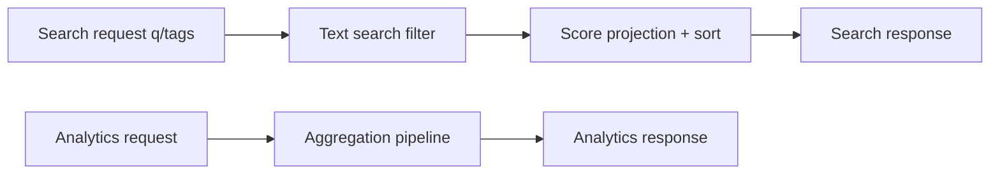

# Project Documentation - DocuForge

## 1. Main Idea and Objective

DocuForge is a collaborative document backend intended for wiki-like content platforms that require:
- Safe concurrent edits
- Rich retrieval and discoverability
- Built-in analytics for content behavior
- Continuous schema evolution support without breaking clients

Primary objective:
Deliver a stable, production-oriented backend foundation where frontend, backend, and database integrations behave consistently under realistic data volume and concurrent write scenarios.

## 2. Problem Statement and Approach

### 2.1 Problems Addressed
- Lost updates when two editors save simultaneously
- Slow or irrelevant search in large content collections
- Operational blind spots without edit/tag analytics
- Migration risk when document schema changes over time

### 2.2 Solution Strategy
- Use version-based optimistic concurrency control with atomic updates
- Use weighted full-text indexing for relevance-aware search
- Use aggregation pipelines for analytics endpoints
- Use dual migration strategy (lazy read transform + background batch migration)
- Use deterministic startup flow (connect -> index -> seed -> serve)

## 3. End-to-End Workflow



## 4. Detailed Execution Flow by Feature

### 4.1 Create Document Flow


### 4.2 Read Document Flow with Lazy Migration


### 4.3 Update Flow with Concurrency Protection


### 4.4 Search and Analytics Flow


## 5. Key Modules and Responsibilities

| Module | Responsibility | Critical Notes |
|---|---|---|
| src/index.js | Orchestration | Strict startup sequence ensures readiness |
| src/db.js | DB singleton | Prevents repeated connection construction |
| src/seed.js | Data and index bootstrap | Idempotent index setup + realistic synthetic data |
| src/routes/documents.js | CRUD + OCC | Atomic update path and conflict-safe behavior |
| src/routes/search.js | Search API | Mandatory text query and optional tag conjunction |
| src/routes/analytics.js | Analytics API | Top edits and tag pair co-occurrence insights |
| scripts/migrate_author_schema.js | Durable migration | Bulk batch updates with progress reporting |
| src/middleware/errorHandler.js | Error normalization | Stable JSON error payloads |

## 6. Tech Stack Rationale

| Technology | Reason Selected | Benefit |
|---|---|---|
| Node.js | Non-blocking I/O and ecosystem maturity | Fast API development and high concurrency handling |
| Express | Minimal and extensible framework | Clean route composition and middleware layering |
| MongoDB | Flexible document model + indexing + aggregation | Ideal for wiki content and evolving schemas |
| Docker Compose | Repeatable local deployment | Faster onboarding and environment parity |
| diff library | Lightweight patch summary generation | Useful human-readable revision metadata |

## 7. Data Flow and Integration Details

### 7.1 Integration Points
- API to MongoDB via native driver
- Seeder to database on startup
- Migration script to same collection via direct batch updates
- Docker Compose network wiring between api and mongo containers

### 7.2 Data Contract Highlights
- Slug is stable external identifier
- Version is mandatory for update operations
- Metadata tracks author and temporal fields
- Revision history keeps last 20 entries on updates

### 7.3 Constraints
- Search endpoint requires q parameter
- Update endpoint rejects missing/invalid version
- Title/content must be non-empty when provided by caller

## 8. Advantages, Benefits, and Trade-offs

Advantages:
- Strong consistency behavior without pessimistic locking
- Search and analytics included as first-class API concerns
- Explicit schema migration support minimizes breaking changes
- Clean modular layout supports maintainability

Benefits:
- Faster feature delivery for content platforms
- Better user experience under concurrent editing
- Better operational insight through analytics
- Lower migration risk over product evolution

Trade-offs / Cons:
- No built-in auth/security middleware yet
- No test automation suite committed yet
- No explicit caching tier for high read hot-spots
- Single-service API can become bottleneck without horizontal scaling

## 9. Testing Strategy and Validation Checks

### 9.1 Suggested Automated Tests
- Unit tests:
  - payload validation behavior per route
  - transformAuthor behavior for both schema variants
- Integration tests:
  - CRUD happy path
  - OCC conflict branch (409)
  - search relevance ordering and tag filtering
  - analytics pipeline result shapes
- Migration tests:
  - conversion count validation
  - idempotency on re-run

### 9.2 Manual Verification Checklist
1. Start stack with Docker Compose.
2. Confirm health endpoint.
3. Create document and verify version 1.
4. Perform valid update with matching version.
5. Retry stale update and confirm 409 response.
6. Run search with q and q+tags variants.
7. Run analytics endpoints and inspect payload structure.
8. Run migration script and verify zero remaining old-schema records.

## 10. Production Readiness Assessment

Current readiness level:
- Strong backend foundation for core functional requirements
- Good consistency model and migration strategy
- Containerized and reproducible local setup

Required before full production:
- Add CI tests and quality gates
- Add authentication, authorization, and API rate limits
- Add observability stack (logs, metrics, traces)
- Add backup/restore and disaster recovery workflows
- Add graceful shutdown and readiness/liveness probes for orchestrators

Render deployment path:
- Use the `render.yaml` blueprint for a Docker web service.
- Point `MONGO_URI` at MongoDB Atlas or another external MongoDB instance.
- Validate the service with the `/health` endpoint after deployment.

## 11. Complete Setup Instructions

### 11.1 Install Dependencies

```bash
npm install
```

### 11.2 Configure Environment

```bash
cp .env.example .env
```

### 11.3 Run with Docker

```bash
docker-compose up --build
```

### 11.4 Run without Docker

```bash
MONGO_URI=mongodb://localhost:27017 npm start
```

### 11.5 Execute Migration

```bash
npm run migrate
```

### 11.6 Deploy on Render

1. Create or select a MongoDB Atlas cluster.
2. Add `MONGO_URI` and `DATABASE_NAME` as environment variables in Render.
3. Import the repository as a Web Service or apply the `render.yaml` blueprint.
4. Deploy the container and confirm the `/health` endpoint responds with status `ok`.

## 12. Folder Structure

```text
src/
  index.js                # bootstrap + route mounting
  db.js                   # DB connection singleton
  seed.js                 # index setup + data seeding
  middleware/
    errorHandler.js       # error normalization
  routes/
    documents.js          # CRUD + OCC + lazy transform
    search.js             # full-text and tag search
    analytics.js          # aggregation endpoints
scripts/
  migrate_author_schema.js # batch migration utility
```

## 13. Final Verification Guidance

For acceptance, validate the following in one clean run:
- Service boot succeeds with no crashes
- Seeding occurs only when collection is empty
- All endpoint contracts return expected status codes and payloads
- OCC conflict path is reproducible and deterministic
- Search and analytics return bounded, structured results
- Migration script completes and leaves no old-schema rows

This confirms the system is coherent across backend logic, database operations, and deployment orchestration.
